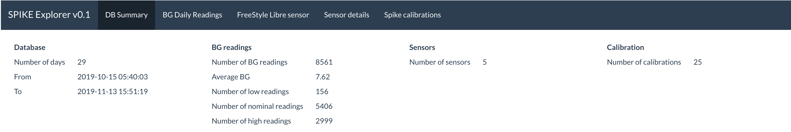
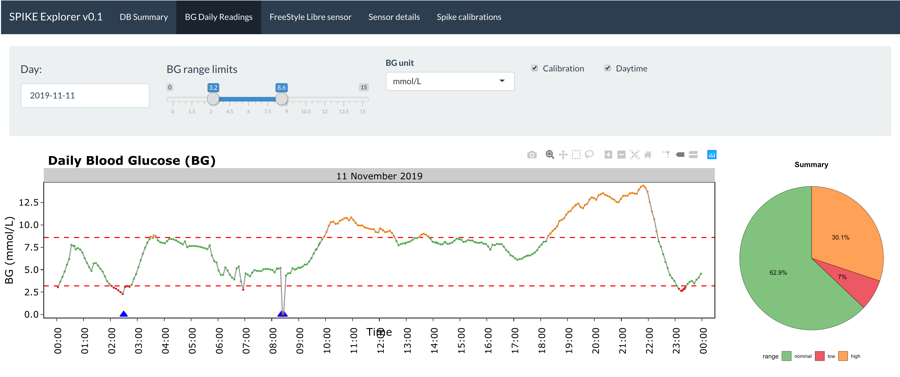
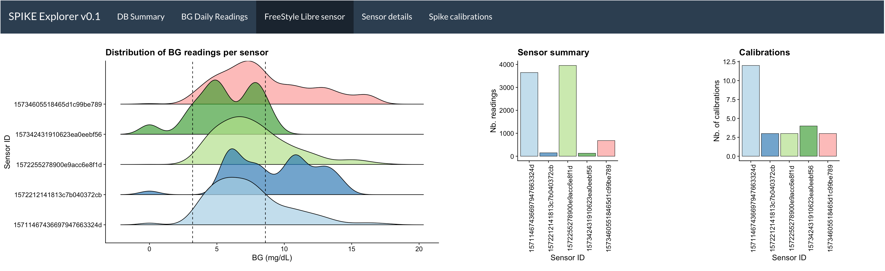
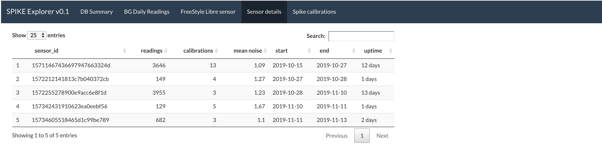

<h1>SPIKE DB</h1>
<i>Visualization of blood glucose data for Diabetes Type 1 patients.</i> 
Version: 0.1  

This R Shiny-based app allows for easy browsing of blood glucose data from the SPIKE app.
SPIKE data are exportable as a SQL3 database (see below), from which are extracted general summaries.
The core of SPIKE DB is the ability to explore day-by-day blood glucose values.
Other information on a sensor-basis are also made available, with the possibility to identify a potentially faulty sensor.
Finally, the effect of calibration as a function of the glucose stability context is also investigated.
 
 
Note that this very initial app was made as a side-project on a rainy weekend.
I realized not long after that SPIKE DB was trying to replicate a solution already existing: <a href="http://www.nightscout.info">the NightScout app</a>.
Hence, this repository is purely symbolic and the SPIKE DB project has been discontinued.

<h2>Input</h2>
Source: <a href="https://spike-app.com">SPIKE app</a> 
Format: SQL3 database (<i>.db</i> file, see first part of <a href="https://github.com/SpikeApp/Spike/wiki/Migration-From-Previous-Versions">this guide</a> for extraction) 

<h2>Requirements</h2>
R and the following packages installed:
<ul>
<li>tidyverse</li>
<li>tidylog</li>
<li>magrittr</li>
<li>ggplot2</li>
<li>ggridges</li>
<li>ggplotify</li>
<li>patchwork</li>
<li>reshape2</li>
<li>treemapify</li>
<li>anytime</li>
<li>scales</li>
<li>timevis</li>
<li>shiny</li>
<li>shinythemes</li>
<li>DT</li>
<li>RColorBrewer</li>
<li>plotly</li>
<li>lubridate</li>
<li>RSQLite</li>
<li>waffle</li></ul>

<h2>Visualizations</h2>

  <h3>DB Summary</h3>
  
<ul>
<li>Homepage of the app</li>
<li>Summarizes the current SPIKE SQL3 database, number of sensors, and calibration</li>
<li>Sensor is the <a href="https://www.freestylelibre.co.uk/libre/">Abbott FreeStyle Libre</a> transformed into a continuous glucose monitor (CGM) via the <a href="https://miaomiao.cool">MiaoMiao transmitter</a></li></ul>

<h3>BD Daily Readings</h3>
  
<ul>
  <li>Selection of day with a calendar drop-out</li>
  <li>Custom setting of lower and upper blood glucose (BG) limits</li>
  <li>Choice of BG unit</li>
  <li>Enable/disable calibration display (blue triangles)</li>
  <li>Enable/disable distinction of day and night</li>
  <li>Piechart summary of time-in-range (TIR), as a percentage</li>
</ul>
Any change of settings is reflected dynamically in the graph and its associated piechart summary.
<i>Note that despite piecharts are the worst visualization possible, it has been kept because healthcare professionals are used to look at them.</i>

<h3>Abbott FreeStyle Libre sensor</h3>
  
<ul><li><b>Distribution of BG readings per sensor</b>: Allows to potentially identify a broken sensor</li>
<li><b>Sensor summary</b>: Number of readings per sensor</li>
<li><b>Calibrations</b>: Number of calibrations per sensor</li></ul>

<h3>Sensor Details</h3>
  
Provides sensor-centric details.

<h3>Calibrations</h3>

This simple graph allows to explore the effect of SPIKE calibration on BG levels,
as well as assess whether calibrations are processed when BG is in range and rather stable,
which are some of the most important aspects of calibration according to the <a href="https://docs.google.com/document/d/1gmAJ4_NRaS6UUDnGDQbKy5klh0KB5SpHwgo6gzWM7ZU/edit">SPIKE Calibration Bible</a>.
